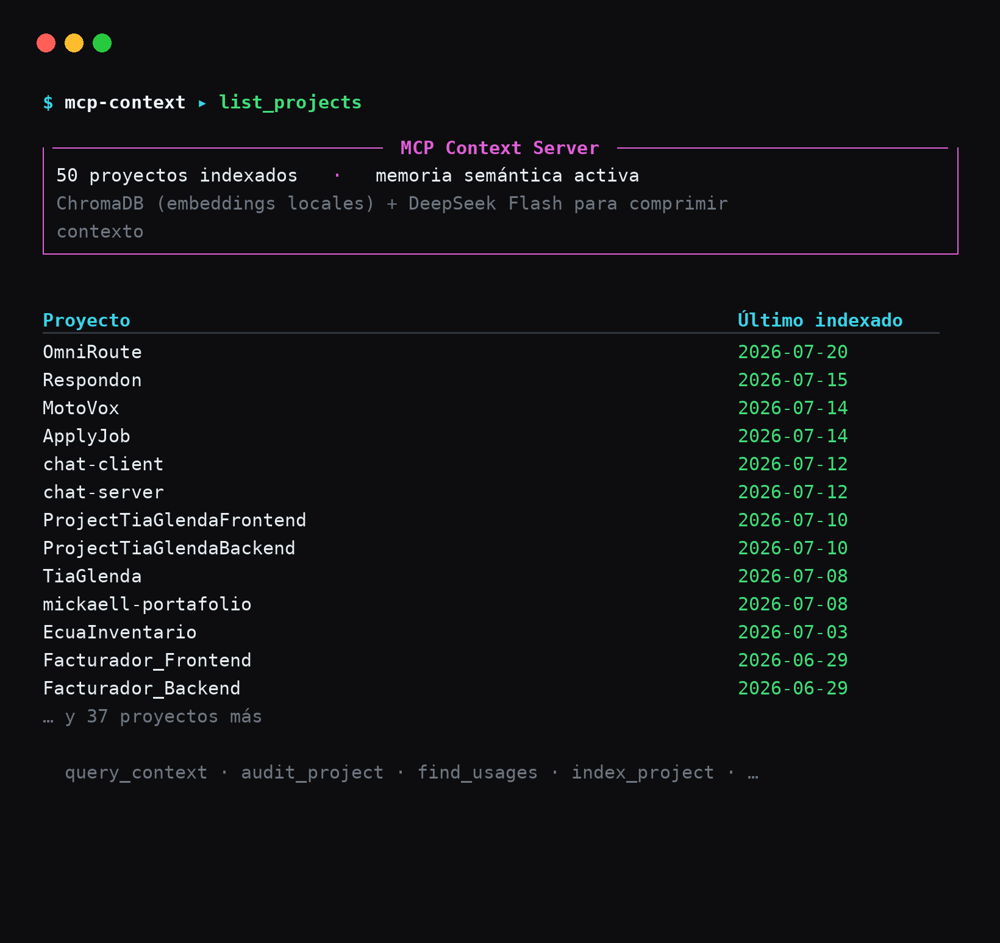

<div align="center">



<br/>


### Memoria inteligente de proyectos para Claude Code — responde con contexto comprimido, no con archivos enteros.

**Indexa tu codebase y busca por similitud semantica; DeepSeek Flash comprime lo relevante antes de que llegue al contexto.**
<br/>
**Menos tokens en Claude Code, mismo contexto util. 9 tools MCP, metricas de uso en PostgreSQL.**

<br/>

<h3>⭐ Dale una estrella si te ahorro tokens.</h3>

[](https://github.com/Mickaell22/mcp-context-server)

<br/>

[](#tools-mcp)
[](#como-funciona)
[](#tools-mcp)
[](#seguridad)

<br/>

### 🧩 Stack

[](https://python.org)
[](https://modelcontextprotocol.io)
[](https://platform.deepseek.com)
[](https://trychroma.com)
[](https://railway.com)
[](https://tailscale.com)

<!-- TODO: no hay archivo LICENSE en el repo. Si agregas uno, descomenta el badge:
[](LICENSE) -->

<br/>

[**🚀 Instalacion**](#instalacion) • [**🛠️ Tools MCP**](#tools-mcp) • [**⚙️ Como funciona**](#como-funciona) • [**🧩 Stack**](#stack) • [**🌐 Dashboard**](https://ia.novamicktools.com)

[**🔧 Config en Claude Code**](#configuracion-en-claude-code) • [**🔑 Variables de entorno**](#variables-de-entorno) • [**🧪 Tests**](#tests-y-evaluación) • [**🔒 Seguridad**](#seguridad)

</div>

---

Servidor MCP que actua como memoria inteligente de proyectos para Claude Code. Indexa codebases, responde queries con contexto relevante comprimido y registra metricas de uso. Reduce el consumo de tokens en Claude Code usando DeepSeek Flash como preprocesador barato en lugar de mandar archivos completos al contexto.

---

## Como funciona

```
Claude Code (cualquier maquina)
        |
        | MCP protocol (local o via Tailscale)
        v
Servidor MCP (local en Kali SSD o en openclaw-server)
        |
        | Indexador de codigo (CPU only, all-MiniLM-L6-v2)
        | ChromaDB persistente en disco
        |
        | fragmentos relevantes
        v
DeepSeek Flash API  ──────────────────────────────────────────► PostgreSQL (Railway)
                                                                         ^
                                                                         |
                                                                Next.js Dashboard
                                                                ia.novamicktools.com
```

1. Claude Code llama a `query_context` con una pregunta en lenguaje natural
2. El servidor busca fragmentos relevantes en ChromaDB por similitud semantica
3. Los fragmentos se envian a DeepSeek Flash para comprimir y filtrar
4. Claude Code recibe solo lo relevante — menos tokens, mismo contexto util
5. Cada operacion queda registrada en PostgreSQL con tokens y costo

---

## Tools MCP

| Tool | Parametros | Descripcion |
|---|---|---|
| `query_context` | `query`, `project` (str o list), `code_only` (bool), `top_k` (int, opcional) | Busqueda semantica con compresion DeepSeek. Soporta multi-proyecto. `top_k` por defecto 8; subelo en proyectos grandes. |
| `index_project` | `project`, `incremental` (bool), `acknowledge_drift` (bool) | Re-indexa un proyecto existente por nombre. Antes de indexar verifica drift git (local detras del remoto o con cambios sin commitear); si lo detecta devuelve `needs_confirmation` y no indexa hasta reintentar con `acknowledge_drift=true`. |
| `list_projects` | — | Lista todos los proyectos registrados en la BD. |
| `clone_project` | `repo_url` | Clona un repo de GitHub e indexa en un solo paso. |
| `register_project` | `path`, `name` (opcional) | Registra un path local sin clonar e indexa. |
| `get_file` | `project`, `file_path` | Retorna el contenido completo de un archivo del indice. |
| `audit_project` | `project`, `categories` (opcional), `paired_with` (opcional), `raw` (opcional) | Auditoria automatica de codigo con hallazgos estructurados (severidad/archivo:linea/fix) + un `summary` consolidado y rankeado por severidad. `raw=true` devuelve los chunks crudos numerados sin compresion DeepSeek (coste 0, alta fidelidad). Autodetecta frontend vs backend. Categorias backend: **correctness**, security, code_quality, error_handling, deprecated, config_secrets, imports, io_operations, tests, **over-engineering**. Frontend: **correctness**, accessibility, performance, state_management, seo, component_design, error_handling, deprecated, tests, bundle_size, hydration, theming, **over-engineering**. `over-engineering` (comun a ambos) detecta complejidad innecesaria — abstraccion prematura, dependencias evitables, reinvencion de stdlib, boilerplate — respetando un guardarrail que nunca marca validacion de input externo, locks, seguridad ni tests. Con `paired_with=<repo hermano>` añade una auditoria de **contrato API** cross-repo (campos, nullability, tipos y endpoints que no calzan entre front y back). Fallback: si no encuentra patrones via busqueda semantica, analiza los chunks mas relevantes con DeepSeek. |
| `find_usages` | `project`, `symbol` | Busca que archivos importan un simbolo o modulo especifico. |

---

## Stack

| Capa | Tecnologia |
|---|---|
| Protocolo | MCP SDK (Python) |
| Embeddings | sentence-transformers — all-MiniLM-L6-v2 (CPU) |
| Vector store | ChromaDB con PersistentClient (disco local) |
| Compresion de contexto | DeepSeek Flash via SDK Anthropic |
| Clonado de repos | GitPython |
| Grafo de imports | ast (Python) + regex (JS/TS) |
| Base de datos | PostgreSQL en Railway |
| Acceso remoto | Tailscale (openclaw-server) |
| Dashboard | Next.js en Railway → ia.novamicktools.com |

---

## Instalacion

```bash
git clone https://github.com/Mickaell22/mcp-context-server
cd mcp-context-server/server

python3 -m venv .venv
source .venv/bin/activate
pip install -r requirements.txt
```

Copia `.env.example` a `.env` y completa las variables:

```bash
cp .env.example .env
```

Aplica el schema en tu PostgreSQL de Railway (solo la primera vez):

```bash
psql $DATABASE_URL -f ../sql/schema.sql
```

Levanta el servidor:

```bash
.venv/bin/python main.py
```

### Paths en openclaw-server

```
/home/mickaell/Escritorio/Proyectos MICKAELL/mcp-context-server/
└── server/
    ├── main.py              # Entry point
    ├── tools/                # Tools MCP
    │   ├── audit_project.py  # Auditoria con fallback DeepSeek
    │   ├── query_context.py  # Busqueda semantica
    │   ├── register_project.py
    │   ├── index_project.py
    │   └── ...
    ├── indexer.py            # Indexacion en ChromaDB
    ├── retriever.py          # Recuperacion semantica
    ├── deepseek_client.py    # Cliente DeepSeek Flash
    └── db.py                 # PostgreSQL (Railway)
```

---

## Configuracion en Claude Code

```bash
claude mcp add --scope user mcp-context -- /ruta/a/server/.venv/bin/python /ruta/a/server/main.py
```

Para verificar que esta corriendo:

```bash
claude mcp list
```

---

## Instalacion como servicio (systemd)

Para que arranque automaticamente en openclaw-server:

```ini
# /etc/systemd/system/mcp-context.service
[Unit]
Description=MCP Context Server
After=network.target

[Service]
User=mickaell
WorkingDirectory=/ruta/a/mcp-context-server/server
ExecStart=/ruta/a/server/.venv/bin/python main.py
Restart=on-failure
EnvironmentFile=/ruta/a/server/.env

[Install]
WantedBy=multi-user.target
```

```bash
sudo systemctl enable mcp-context
sudo systemctl start mcp-context
```

---

## Variables de entorno

| Variable | Descripcion |
|---|---|
| `DEEPSEEK_API_KEY` | API key de DeepSeek |
| `GITHUB_TOKEN` | Token de GitHub (scope: `repo`) para repos privados |
| `DATABASE_URL` | PostgreSQL en Railway (URL publica para acceso externo) |
| `PROJECTS_BASE_PATH` | Directorio base donde se clonan los repos |
| `CHROMA_PERSIST_PATH` | Directorio donde ChromaDB guarda los vectores en disco |
| `LOG_LEVEL` | Nivel de log — `INFO` por defecto |
| `MAX_DISTANCE` | Umbral de distancia coseno para filtrar chunks (default: `1.2`). Con `all-MiniLM-L6-v2`, queries en lenguaje natural contra codigo suelen dar distancias de 0.6–1.1; valores menores a 1.0 filtran demasiado y devuelven contexto vacio. |
| `DEEPSEEK_TIMEOUT` | Timeout en segundos para llamadas a DeepSeek (default: `60.0`). El SDK Anthropic usa 10 min por defecto, demasiado para una tool MCP — bajarlo evita que `query_context`/`audit_project` se cuelguen. |
| `EMBEDDING_MODEL` | Modelo SentenceTransformers para embeddings (default: `all-MiniLM-L6-v2`). Para mejor recall sobre codigo: `jinaai/jina-embeddings-v2-base-code` o `nomic-ai/nomic-embed-text-v1.5`. Cambiarlo invalida el indice Chroma (cambia la dimension del vector) y exige reindex **full** de todos los proyectos. |
| `AUDIT_TOP_K` | Nº de chunks que recupera cada categoria del audit (default: `18`). El audit prioriza recall sobre costo; `query_context` sigue usando `TOP_K_RESULTS=8`. |
| `AUDIT_BATCH_MAX_CHARS` | Presupuesto de caracteres por llamada a DeepSeek en el audit (default: `120000` ≈ 30K tokens). `audit_project` parte los chunks de una categoria en lotes que no excedan este limite, para no superar la ventana de ~64K de `deepseek-chat` en repos grandes (categorias estructurales como `accessibility` cargan todos los componentes). |
| `AUDIT_MAX_CHUNKS` | Tope total de chunks por categoria del audit (default: `0` = sin tope, audita todo en lotes). Subilo a un entero para acotar costo en repos grandes a cambio de recall. |
| `AUDIT_RAW_MAX_CHARS` | Presupuesto TOTAL de caracteres de la respuesta del audit en modo `raw` (default: `150000`; `0` = sin tope). Evita respuestas de 300K+ chars que saturan el contexto del que llama; las categorias recortadas avisan y sugieren pedirse solas con `categories=[...]`. |
| `AUDIT_VERIFY_ENABLED` | Verificacion de hallazgos CRITICO/ALTO contra el archivo completo citado (default: `true`). Una llamada DeepSeek extra por audit; los descartados quedan en `summary.descartados` con su motivo. `false` la desactiva. |
| `RERANK_ENABLED` | Activa el reranking híbrido semántico+léxico post-retrieval (default: `true`). `false` lo desactiva. |
| `RERANK_CANDIDATE_MULT` / `RERANK_W_SEM` / `RERANK_W_LEX` | Tamaño del pool de candidatos (`top_k × mult`, default 3) y pesos del score (default 0.7 semántico / 0.3 léxico). |

Las variables criticas (`DEEPSEEK_API_KEY`, `DATABASE_URL`, `PROJECTS_BASE_PATH`, `CHROMA_PERSIST_PATH`) son validadas al arrancar el servidor: si falta alguna, el proceso falla con un `RuntimeError` que indica exactamente cual variable falta.

---

## Costo estimado DeepSeek Flash

| | Precio |
|---|---|
| Input | $0.14 / 1M tokens |
| Output | $0.28 / 1M tokens |
| Query promedio (~5k input, ~1k output) | ~$0.001 |
| 1000 queries al mes | ~$1.00 |

---

## Arquitectura multi-maquina

PostgreSQL es **compartido en la nube** entre todas las maquinas que usen el servidor. ChromaDB es **local de cada maquina** (`CHROMA_PERSIST_PATH`).

Consecuencias importantes:

- `list_projects` muestra **todos** los proyectos registrados desde cualquier maquina.
- `query_context`, `audit_project` y `get_file` solo funcionan para proyectos indexados **en esa maquina**. Un proyecto que aparece en la lista pero devuelve contexto vacio normalmente fue indexado en otra maquina — no esta corrupto.
- Para usar un proyecto en una nueva maquina, hay que re-indexarlo localmente aunque ya aparezca en la lista: `index_project` (si el path en Postgres coincide con la ruta local) o `register_project` (si el path es distinto).
- **No usar `delete_project` para limpiar proyectos de otra maquina**: borra la fila de PostgreSQL compartido y rompe el indice en todas las maquinas que lo usen. `delete_project` es irreversible y afecta a todos.

### Re-indexar por script (sin iniciar el servidor)

Si se llama `indexer.index_project()` directamente desde un script, la whitelist en memoria esta vacia y `is_file_allowed()` rechaza todos los archivos — se indexan 0 archivos mientras el modo full borra los chunks previos. Hay que poblar la whitelist antes:

```python
import security, indexer
security.add_allowed_path("/ruta/al/proyecto")
indexer.index_project(project_id, "/ruta/al/proyecto")
```

---

## Tests y evaluación

Dos capas, separadas a propósito:

**Capa 1 — recall de retrieval (determinista, gratis, CI-able).** `tests/test_retrieval_recall.py` indexa las fixtures con bugs sembrados (`tests/fixtures/fake_backend` + `fake_frontend`) en un ChromaDB efímero y verifica que el archivo de cada bug se recupere con la query de su categoría. No usa DeepSeek ni Postgres; mide chunking + embeddings + reranking. Se salta solo si no hay `sentence-transformers`.

```bash
cd server && ./.venv/bin/python -m pytest tests/ -q
```

**Capa 2 — recall end-to-end del audit (no-determinista, ~centavos).** `eval/run_eval.py` corre el audit completo (con `paired_with` para el contrato) contra las fixtures y mide cuántos bugs REPORTA de verdad, con un scorecard ✓/✗ por bug. También verifica los `must_not_flag`: código legítimo (locks, validación de input externo) que NO debe aparecer en los hallazgos — el termómetro de falsos positivos, clave para `over-engineering`. Usa DeepSeek + Postgres; correr a mano al afinar prompts/modelo/`AUDIT_TOP_K`, **no en CI**.

```bash
cd server && ./.venv/bin/python eval/run_eval.py
```

El *golden set* vive en `tests/fixtures/expected.json` (archivo, categoría, keywords, severidad por bug, más `must_not_flag` para los falsos positivos). Para medir recall hay que tener ground truth, y la única forma confiable es sembrar los bugs uno mismo: por eso las fixtures son sintéticas, no un repo real.

---

## Seguridad

- Solo opera dentro de rutas explicitamente permitidas (whitelist dinamica desde PostgreSQL)
- Bloquea archivos sensibles: `.env`, `.pem`, `.key`, `secrets.json`, `CLAUDE.md`, etc.
- Extensiones indexadas: `.py .js .ts .jsx .tsx .java .go .rs .dart .kt .swift .rb .php .c .cpp .h .html .css .scss .md .json .yaml .sql .sh`
- No ejecuta ningun comando del sistema — unica excepcion es `git clone` via GitPython
- No expuesto a internet — acceso local o via Tailscale
